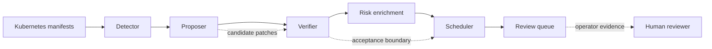

# k8s-auto-fix

`k8s-auto-fix` is a closed-loop pipeline that detects Kubernetes misconfigurations, proposes JSON patches, verifies them against guardrails, and schedules accepted fixes. It supports deterministic rules as well as Grok and OpenAI-compatible LLM modes, and underpins the accompanying research paper.

## Why this matters
Automated remediation is only useful if operators can trust the proposed change. This project treats the model or rules engine as a candidate generator, then makes verification the acceptance boundary: patches must survive JSON Patch safety checks, policy re-checks, schema validation, optional rescans, and Kubernetes server-side dry-run before they reach scheduling or review.

The practical claim is narrow: validate security fixes before they hit infrastructure.



## Key features
- End-to-end detector -> proposer -> verifier -> risk -> scheduler -> queue workflow with reproducible CLI entry points.
- Switchable proposer backends (rules, Grok, vendor, vLLM) with semantic regression checks, targeted policy guidance, and optional response caching for remote model runs.
- Verifier integrates kube-linter, Kyverno, `kubectl apply --dry-run=server`, and bespoke safety gates before a patch is accepted.
- Metrics bundles, benchmarks, and reproducibility scripts that back the paper's evaluation.

## Reviewer quick path
If you are reviewing the project for research, hiring, or collaboration, start here:

1. Read the architecture overview: [docs/ARCHITECTURE.md](docs/ARCHITECTURE.md).
2. Check local prerequisites without changing cluster state:
   ```bash
   make doctor
   ```
3. Run the CI-safe fixture regression. This does not require kube-linter, Kyverno, kubectl, a cluster, or API keys:
   ```bash
   make tiny-regression
   ```
4. Preview the lightweight pipeline plan without writing outputs:
   ```bash
   make pipeline-plan
   ```
5. Inspect evidence packaging and operator review helpers:
   ```bash
   make evidence-manifest-smoke
   make review-packet-concise-smoke
   ```

See [docs/DEMO.md](docs/DEMO.md) for a short review script and expected signals.
For cluster-backed validation, use a local Kind/dev cluster and follow [docs/LIVE_EVAL.md](docs/LIVE_EVAL.md).

## Getting started
```bash
pip install -r requirements.txt    # dependencies (see make setup)
make doctor                        # check local prerequisites and optional tools
make tiny-regression               # CI-safe detector/proposer/verifier/scheduler/queue smoke
make kind-up                       # optional: bring up a Kind verification cluster
make fixtures                      # optional: seed RBAC/NetworkPolicy fixtures after a cluster is active
make e2e                           # optional: scanner-backed end-to-end run
```

## Workflow at a glance
| Stage | Command | Output |
| ----- | ------- | ------ |
| Detect misconfigurations | `python -m src.detector.cli --in data/manifests --out data/detections.json --policies-dir data/policies/kyverno --jobs 4` | `data/detections.json` |
| Generate patches | `python -m src.proposer.cli --detections data/detections.json --out data/patches.json --config configs/run.yaml --jobs 4` | `data/patches.json` |
| Verify patches | `python -m src.verifier.cli --patches data/patches.json --detections data/detections.json --out data/verified.json --include-errors --require-kubectl --enable-rescan --policies-dir data/policies/kyverno --jobs 4` | `data/verified.json` |
| Compute risk | `make cti && python -m src.risk.cli --detections data/detections.json --out data/risk.json --epss-csv data/epss.csv --kev-json data/kev.json` | `data/risk.json` |
| Schedule fixes | `python -m src.scheduler.cli --verified data/verified.json --detections data/detections.json --risk data/risk.json --out data/schedule.json` | `data/schedule.json` |
| Summarize rollout batches | `python -m src.scheduler.cli --verified data/verified.json --detections data/detections.json --risk data/risk.json --out data/schedule.json --batch-group-by policy --batches-out tmp/schedule-batches.json` | `tmp/schedule-batches.json` |
| Queue accepted patches | `python -m src.scheduler.queue_cli enqueue --db data/queue.db --verified data/verified.json --detections data/detections.json --risk data/risk.json` | `data/queue.db` |

Benchmark helpers (`make benchmark-grok200`, `make benchmark-full`, `make benchmark-scheduler`) and aggregation commands (`python -m src.eval.metrics`, `make summarize-failures`) mirror the evaluation in the paper.
Use `make pipeline-plan` to print the default lightweight detector -> proposer -> verifier -> risk -> scheduler command plan without running it.

## Components
- **Detector (`src/detector`)** wraps kube-linter and Kyverno, applies extra guards (hostPath, hostPort, CronJob traversal), and emits rigid detections.
- **Proposer (`src/proposer`)** merges rule-based fixes with LLM output, validates JSON Patch structure, blocks destructive edits (container or volume removal, service-account regressions), and can cache validated model responses by input/config hash.
- **Verifier (`src/verifier`)** rechecks policy conformance, performs `kubectl` dry-runs, enforces custom safety assertions, and optionally rescans the targeted policy.
- **Scheduler (`src/scheduler`)** ranks accepted patches using acceptance probability, expected runtime, exploration, aging, and KEV signals; supports queue management and opt-in batch summaries.
- **Scheduler batches and rollout helpers (`src/scheduler/batches.py`, `src/scheduler/rollout.py`)** group prioritized fixes by policy, namespace, owner/team, or root cause, then annotate batches with change-window and blast-radius metadata for operator-friendly rollout planning.
- **Risk enrichment (`src/risk`)** fuses EPSS/KEV feeds and optional image scans for downstream prioritisation.
- **Automation (`Makefile`, `scripts/`)** provides repeatable entry points for experiments, telemetry refresh, and reproducibility bundles.

## Repository layout
- `archives/` – historical exports and large bundles kept out of the active workspace.
- `configs/` – pipeline presets (`run.yaml`, `run_grok.yaml`, `run_rules.yaml`).
- `data/` – retains the canonical folders (`data/manifests`, `data/batch_runs`, etc.) and now exposes curated views via `data/corpora/` (inputs) and `data/outputs/` (generated artefacts). See `data/README.md` for details.
- `data/samples/tiny_regression/` – small CI-safe manifests and expected outcomes for detector, proposer, verifier, scheduler, and queue behavior.
- `docs/` – research notes, policy guidance, reproducibility appendices, future work plans.
- `infra/fixtures/` – RBAC, NetworkPolicies, and manifest samples (CronJob scanner, Bitnami PostgreSQL) for reproducing edge cases.
- `logs/` – ignored local proposer/verifier transcripts and run logs; commit only sanitized summaries under `data/outputs/` or `docs/`.
- `notes/` – working notes and backlog items formerly at the repository root.
- `paper/` – manuscript sources; appendices live in `paper/appendices.tex` (no zip bundle checked in), and Overleaf-ready sources sit under `paper/overleaf/`.
- `scripts/` – maintenance and evaluation helpers; see `scripts/README.md` for an index by pipeline stage.
- `src/` – core packages (`common`, `detector`, `proposer`, `risk`, `scheduler`, `verifier`).
- `tests/` – pytest suite validating detectors, proposer guardrails, verifier gates, scheduler scoring, CLI tooling.
- `tmp/` – scratch workspace (ignored by git). Historic large exports remain under `archives/` if needed.

## Documentation and helper scripts
- [Architecture](docs/ARCHITECTURE.md) maps the detector -> proposer ->
  verifier -> risk -> scheduler -> queue flow and the operator review path.
- [Contributing](docs/CONTRIBUTING.md) covers local setup, test tiers, artifact hygiene, and secret-handling expectations.
- [Troubleshooting](docs/TROUBLESHOOTING.md), [Security Model](docs/SECURITY_MODEL.md), and [Artifact Policy](docs/ARTIFACT_POLICY.md) explain failure triage, verifier trust boundaries, and tracked-artifact retention.
- `scripts/doctor.py` (`make doctor`) checks Python packages, optional Kubernetes tools, and key repository paths.
- `scripts/validate_configs.py` (`make validate-configs`) validates checked-in YAML config structure.
- `scripts/check_docs_links.py` (`make docs-link-check`) checks local Markdown links and heading anchors in the docs set.
- `scripts/check_metrics_consistency.py` (`make metrics-consistency`) checks paper-facing metric text against canonical JSON artifacts without modifying files.
- `scripts/clean_generated.py` (`make clean-generated`) lists ignored generated outputs that are safe to remove with the script's explicit `--delete` flag.
- `scripts/run_pipeline.py` (`make pipeline-plan`, `make pipeline-manifest-smoke`, `make pipeline-status-smoke`) prints a rules-mode pipeline plan, optionally writing reproducibility and per-stage status JSON with declared input/output paths, file hashes, and remediation hints, or runs it when invoked directly with `--run` and optional `--resume`.
- `scripts/run_tiny_regression.py` (`make tiny-regression`) validates the tiny fixture pack without kube-linter, Kyverno, kubectl, a cluster, or API keys.
- `scripts/build_review_packet.py` (`make review-packet-smoke`, `make review-packet-concise-smoke`, `make review-packet-rollout-smoke`) combines verifier summaries, selected patch diffs, schedule explanation, optional rollout batches, queue health, and artifact traceability into a bounded operator review packet; `--markdown-mode concise` emits a PR/release-friendly summary without diff blocks.
- `scripts/render_patch_diff.py` (`make patch-diff-smoke`) renders unified before/after YAML diffs for patch review.
- `scripts/verifier_report.py` (`make verifier-report`) groups verifier rejects by gate, policy, and error with suggested next actions.
- `scripts/artifact_index.py` (`make artifact-index-smoke`) inventories tracked artifact-like files; write full indexes to ignored `tmp/` paths when needed.
- `scripts/artifact_traceability.py` (`make artifact-traceability-smoke`) emits size, SHA-256, producer, and category records for selected artifacts.
- `scripts/build_evidence_manifest.py` (`make evidence-manifest-smoke`, `make evidence-manifest-pipeline-smoke`, `make evidence-manifest-claims-smoke`, `make evidence-manifest-claims-enforce`) composes selected artifact traceability records with producer commands, claim labels, artifact hashes, optional pipeline manifest/status stage metadata, optional paper/research claim-table coverage, and claim-coverage summaries into JSON or Markdown. Add `--fail-on-uncovered-claims` with `--claims-table` when uncovered expected claims should fail the command.
- `scripts/gitops_writeback.py` (`make gitops-plan-smoke`) builds a dry-run writeback plan for accepted patches, including skipped entries and reasons, without changing files, branches, commits, or PRs.
- `scripts/scheduler_explain.py` (`make scheduler-explain-smoke`) explains scheduler score inputs, components, and final priority order.
- `scripts/queue_report.py` (`make queue-report-smoke`) reports scheduler queue health from SQLite in read-only mode.

## Paper and appendices
- Main manuscript: `paper/access.tex` (title: “Closed-Loop Threat-Guided Auto-Fixing of Kubernetes Container Security Misconfigurations”).
- Supplemental appendices: `paper/appendices.tex` (plain-English reading guide, risk worked example, glossary, artifact index). Legacy appendix zip bundles have been removed from the repo.
- To push to Overleaf, use the contents of `paper/` (or the mirror under `paper/overleaf/`); no zip archives are tracked here.

## Configuration
`configs/run.yaml` centralises proposer configuration:
```yaml
seed: 1337
max_attempts: 3
proposer:
  mode: grok          # rules | grok | vendor | vllm
  retries: 2
  timeout_seconds: 60
  cache_dir: tmp/proposer-cache  # optional; caches validated non-rules responses
grok:
  endpoint: "https://api.x.ai/v1/chat/completions"
  model: "grok-4.3"
  api_key_env: "XAI_API_KEY"
retry_budgets:
  default: 3
  no_latest_tag: 2
vendor:
  endpoint: "https://api.openai.com/v1/chat/completions"
  model: "gpt-4o-mini"
  api_key_env: "OPENAI_API_KEY"
vllm:
  endpoint: "https://<RUNPOD_ENDPOINT>/v1/chat/completions"
  model: "meta-llama/Meta-Llama-3-8B-Instruct"
  api_key_env: "RUNPOD_API_KEY"
rules:
  enabled: true
```
Export the appropriate API key (`XAI_API_KEY`, `OPENAI_API_KEY`, `RUNPOD_API_KEY`) before invoking remote modes.

## Testing and QA
- `make doctor` - check Python, required packages, optional Kubernetes tools, and key repo paths.
- `make validate-configs` - validate checked-in YAML config structure.
- `make docs-link-check` - check local Markdown links and heading anchors in the docs set.
- `make metrics-consistency` - fail if paper-facing metrics drift from canonical JSON artifacts.
- `make secret-scan` - scan tracked and unignored repo text files for common secret/token patterns, skipping artifact-heavy sample/generated paths by default.
- `make pipeline-plan` - preview the lightweight pipeline commands without writing outputs.
- `make pipeline-manifest-smoke` - write a dry-run reproducibility manifest to ignored `tmp/`.
- `make pipeline-status-smoke` - write dry-run per-stage pipeline status to ignored `tmp/`.
- `make test` - run the default pytest suite without requiring a Kubernetes cluster, API keys, or generated evaluation artifacts.
- `make tiny-regression` - run the CI-safe fixture pack through builtin detector checks, rule-based proposer/verifier, scheduler, and a temp queue.
- `make artifact-test` - opt into generated-artifact checks such as patch minimality/idempotence for `data/patches.json`.
- `make artifact-index-smoke` - run a bounded tracked-artifact inventory using `scripts/artifact_index.py --limit 10`.
- `make artifact-traceability-smoke` - compute a deterministic traceability record for `data/patches.json`.
- `make evidence-manifest-smoke` - build a small evidence manifest with artifact hashes, producer command, and claim labels.
- `make evidence-manifest-pipeline-smoke` - build an evidence manifest that includes pipeline stage inputs, outputs, hashes, and statuses.
- `make evidence-manifest-claims-smoke` - build an evidence manifest with expected-claim coverage, including a deliberately uncovered smoke claim for reporting.
- `make evidence-manifest-claims-enforce` - build an evidence manifest and fail if the expected claims table has uncovered claims.
- `make gitops-plan-smoke` - build a dry-run GitOps writeback plan into ignored `tmp/` without mutating files or git state.
- `make patch-diff-smoke` - render a bounded patch review diff for one smoke detection.
- `make verifier-report` - summarize rejected verifier records from `data/verified.json`.
- `make scheduler-explain-smoke` - explain a sample scheduler decision from stdin.
- `make scheduler-batches-smoke` - emit grouped schedule batch summaries into ignored `tmp/` files.
- `make queue-report-smoke` - render a read-only queue health JSON report from `data/queue.db`.
- `make review-packet-smoke` - build a bounded operator review packet for one smoke detection.
- `make review-packet-concise-smoke` - build a PR/release-friendly review packet summary without diff blocks.
- `make review-packet-rollout-smoke` - build a concise review packet with scheduler batch rollout annotations.
- `make clean-generated` - list ignored generated outputs that `scripts/clean_generated.py --delete` may remove.
- `make e2e` - exercises the full pipeline on bundled manifests.
- `make summarize-failures` - aggregates verifier rejects by policy/manifest.
- `make reproducible-report` - rebuilds the research appendix with current artifacts.
- `scripts/parallel_runner.py` - parallelise proposer/verifier workloads; `scripts/probe_grok_rate.py` sizes safe LLM concurrency.

## Metrics aligned to the paper (traceable in-repo)
- **Full rules + guardrails replay** – 13,338 / 13,373 patched items accepted (99.74%; auto-fix rate 0.8486 over 15,718 detections; median patch ops 9) from `data/metrics_rules_full.json` (`patches_rules_full.json.gz`, `verified_rules_full.json.gz`).
- **Rules on the 5k extended corpus** – historical checked-in verifier-record snapshot records 4,677 / 5,000 accepted (93.54%; median ops 6) from `data/metrics_rules_5000.json` (`patches_rules_5000.json`, `verified_rules_5000.json`); `make reproducible-report` re-renders these JSON artifacts and does not rerun the verifier.
- **Grok/xAI 5k proposer** – 4,426 / 5,000 accepted (88.52%; median ops 9) from `data/outputs/batch_runs/grok_5k/metrics_grok5k.json`.
- **Supported corpus (rules)** – 1,264 / 1,264 accepted (median ops 8) captured in `data/outputs/batch_runs/secondary_supported/summary.json` and `metrics_rules.json`.
- **Live-cluster replay** – 1,000 / 1,000 dry-run and live-apply success on the stratified slice (`data/live_cluster/summary_1k.csv`).
- **Scheduler fairness** – `data/metrics_schedule_compare.json` shows top-50 high-risk items at median rank 25.5 (P95 48) for the bandit vs median 422.5 (P95 620) under FIFO; wait-time sweeps live in `data/metrics_schedule_sweep.json`.

Policy-level success probabilities and runtimes regenerate via `scripts/compute_policy_metrics.py` into `data/policy_metrics.json`. Scheduler sweeps and fairness telemetry are viewable at `data/outputs/scheduler/metrics_schedule_sweep.json`.

Large corpus artefacts now live under `data/outputs/` and are stored as compressed `.json.gz` files to keep the repository lean. Gunzip the patches/verified/metrics files there before using tooling that expects plain `.json` inputs.

## Related work
| System | Scope in paper | Evidence / guardrails | Scheduling |
| ------ | -------------- | --------------------- | ---------- |
| **k8s-auto-fix (this work)** | Closed-loop detect → propose → verify → schedule | JSON Patch rules + optional LLMs behind policy/schema/`kubectl --dry-run` gates; secret sanitisation; CRD/fixture seeding | Risk-aware bandit with aging + KEV boost (`data/metrics_schedule_compare.json`) |
| GenKubeSec (2024) | LLM-based detection/localization/remediation; authors report precision 0.990, recall 0.999 on a ~277k KCF corpus with 30-sample expert validation | Human review; no automated guardrails | None (FIFO human review) |
| Kyverno (mutation engine) | Admission-time mutation/validation; depends on cluster fixtures | Policy-driven mutate/validate; CLI baseline scripted in `scripts/run_kyverno_baseline.py` with results in `data/baselines/kyverno_baseline.csv` | FIFO admission queue |
| Borg/SRE playbooks | Production auto-remediation for infra fleets | Health checks, rollbacks, throttling; no public acceptance % | Priority queues / toil budgets |
| LLMSecConfig (2025) | LLM remediation prompts with scanner checks | Scanner re-checks; no server-side dry-run | None |

## Baselines and Reproducibility

- Kyverno mutate baseline (simulate or real): `scripts/run_kyverno_baseline.py`
- Polaris mutate/CLI fix baseline (simulate or real): `scripts/run_polaris_baseline.py`
- MutatingAdmissionPolicy baseline (simulate or YAML generation): `scripts/run_mutatingadmission_baseline.py`
- LLMSecConfig-style slice: `scripts/run_llmsecconfig_slice.py` (requires `OPENAI_API_KEY`)
- Risk throughput (KEV-weighted): `scripts/eval_risk_throughput.py`
- Unified baseline comparison: `scripts/compare_baselines.py` (writes CSV/MD/TeX)

Quick start to regenerate bundles and baselines (simulation mode):
```
scripts/reproduce_all.sh
```

See `ARTIFACTS.md` for artifact map, `docs/VERIFIER.md` for guardrails, `docs/BASELINES.md` to run baselines, `docs/RISK_EVAL.md` for prioritization metrics, and `docs/LIVE_EVAL.md` for live-cluster methodology.
