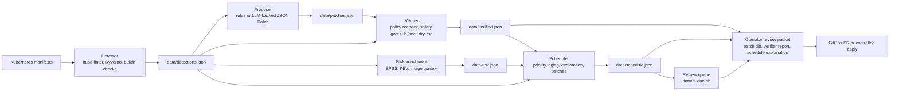

# Architecture

`k8s-auto-fix` is a closed-loop remediation pipeline. It reads Kubernetes
manifests, turns detector findings into RFC 6902 JSON Patch candidates, accepts
only patches that pass verifier gates, then ranks and queues the accepted work
for operator review.

## System Flow

## Component Responsibilities

| Component | Responsibility | Main artifacts |
| --- | --- | --- |
| Detector | Finds manifest-level Kubernetes security misconfigurations and emits structured detections. | `data/detections.json` |
| Proposer | Generates patch candidates from deterministic rules or configured model backends, then applies patch safety checks before writing candidates. | `data/patches.json` |
| Verifier | Acts as the acceptance boundary by rechecking policy, project safety assertions, optional rescans, and server-side dry-run behavior. | `data/verified.json` |
| Risk enrichment | Adds prioritization context from KEV, EPSS, and optional image evidence. | `data/risk.json` |
| Scheduler | Ranks accepted patches, groups optional rollout batches, and feeds queue operations. | `data/schedule.json`, batch JSON |
| Queue and review helpers | Package the accepted work into bounded operator-facing evidence. | `data/queue.db`, review packet Markdown |

## Operator Review Flow

1. Generate or refresh detections, patches, verifier output, risk data, and the
   schedule using the commands in the [workflow table](../README.md#workflow-at-a-glance).
2. Review verifier output first. Rejected records stay out of rollout planning
   until regenerated, manually fixed, or parked with a reason.
3. Inspect the accepted patch diff with `make patch-diff-smoke` or
   `scripts/render_patch_diff.py`, focusing on workload identity, networking,
   storage, probes, resources, and generated secret references.
4. Read scheduler context with `make scheduler-explain-smoke`; when batches are
   enabled, confirm the batch grouping matches the intended owner, namespace,
   policy, or change-window workflow.
5. Build the bounded review packet with `make review-packet-smoke` or
   `make review-packet-concise-smoke` so patch diff, verifier summary, schedule
   explanation, queue health, and artifact traceability travel together.
6. For production-bound changes, follow the source-controlled path in
   [GitOps Integration and Drift Control](GITOPS.md) and the approval boundaries
   in the [Security Model](SECURITY_MODEL.md).

## Trust Boundaries

- The proposer is a candidate generator, not an acceptance boundary.
- The verifier decides whether a generated patch is usable by downstream review
  and scheduling.
- The scheduler and queue prioritize only accepted work; they do not make a
  rejected patch safe.
- Operators remain responsible for production approval, merge/apply timing,
  monitoring, and rollback.

## Review Invariants

- Keep generated patch artifacts free of raw secret values.
- Prefer minimal manifest diffs and source-controlled rollout through GitOps.
- Treat disabled verifier gates, skipped `kubectl` dry-run, LLM attempt errors,
  operator-managed resources, and unclear rollback ownership as manual review
  triggers.
- Keep large generated artifacts out of git unless the artifact policy says they
  are part of the reproducibility record.
